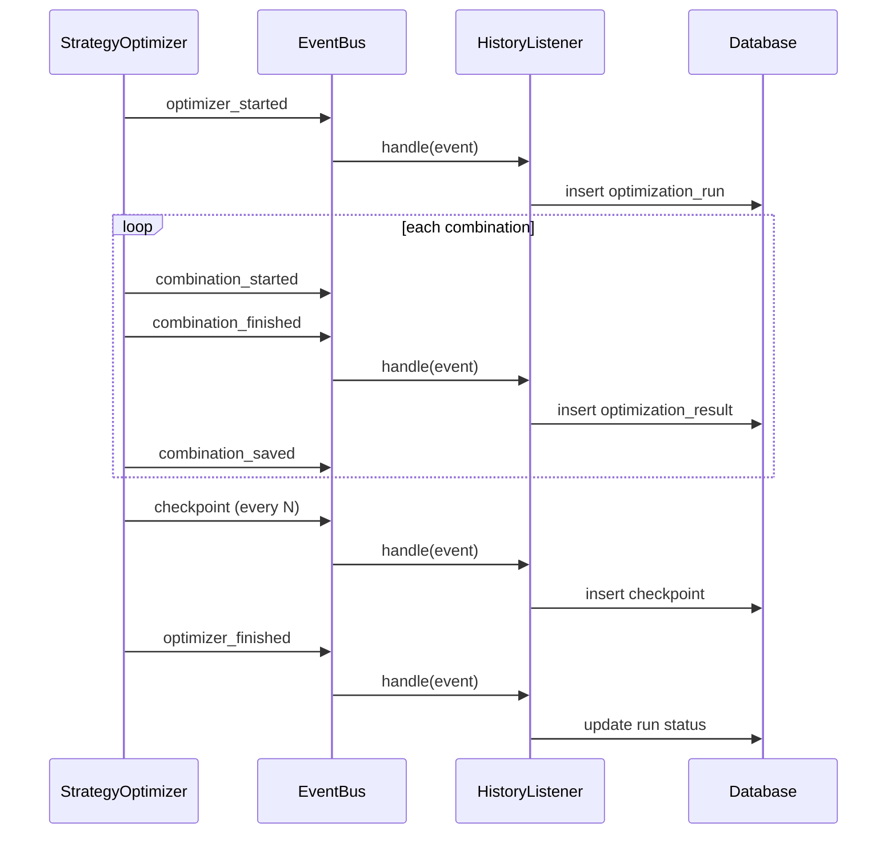

## Execution Manager (Control Plane)

The orchestration layer is now centered on `execution_manager/`.

   - `optimization/results/execution_report.json`
   - `optimization/results/execution_report.txt`
   - `optimization/results/execution_report.html`

### Main components

### CLI entrypoint

 Execution Replay service for complete post-run audit by execution_id
 Execution Metrics persistence for historical performance comparison
- `GET /api/v1/execution`
## RC1 Validation Flow

The RC1 command orchestrates controlled real-load validation and produces executive artifacts:

- `python main.py execution-manager-rc1`
- 500 combinations validation run
- 1000 combinations validation run
- failure matrix simulation and recovery verification
- release candidate artifact generation
- `GET /api/v1/execution/status`
- `GET /api/v1/execution/jobs`
- `GET /api/v1/execution/progress`
- `GET /api/v1/execution/performance`
- `GET /api/v1/execution/heartbeat`
- `GET /api/v1/execution/watchdog`
- `GET /api/v1/execution/report`
- `GET /api/v1/execution/incidents`
- `POST /api/v1/execution/pause`
- `POST /api/v1/execution/resume`
- `POST /api/v1/execution/cancel`
- `POST /api/v1/execution/retry`

### WebSocket additions

- `/api/v1/ws/execution`
- `/api/v1/ws/progress`
- `/api/v1/ws/jobs`
- `/api/v1/ws/performance`
- `/api/v1/ws/heartbeat`
# Architecture - Event-Driven Optimizer

## Overview
The optimizer infrastructure follows Observer Pattern and dependency injection.
The optimizer publishes lifecycle events and never writes to database directly.

## Event Flow
1. StrategyOptimizer starts and publishes `optimizer_started`.
2. For each parameter combination:
   - publish `combination_started`
   - execute backtest/evaluation
   - publish `combination_finished`
   - publish `combination_saved`
3. Every `CHECKPOINT_INTERVAL` combinations:
   - publish `checkpoint`
4. When complete:
   - publish `optimizer_finished`

Listeners consume the same event stream independently.

## Modules
- `core/events/events.py`: event types and event payload model.
- `core/events/interfaces.py`: listener interface.
- `core/events/event_bus.py`: event dispatcher (sync/async).
- `core/events/listeners.py`: default listeners:
  - `HistoryListener`: persists run/result/checkpoint/backtest metadata.
  - `LogListener`: structured event logs.
  - `MetricsListener`: in-memory real-time counters and best metrics.

## Persistence Responsibilities
`HistoryListener` uses repository/service layer only:
- creates optimizer run records
- saves each finished combination immediately
- saves checkpoints
- finalizes execution status

## Checkpoint and Resume
- `CHECKPOINT_INTERVAL` controls periodic checkpoint creation.
- `HistoryListener.resume_execution(execution_id)` returns the latest persisted progress.
- Optimizer accepts `resume_from` index and continues from that point in the parameter stream.

## Execution Session Metadata
Run config carries metadata to events:
- execution_id
- strategy_name / strategy_version
- git_commit
- host
- python_version
- workers

## Extensibility
New integrations are added as listeners without modifying optimizer code:
- DashboardListener (WebSocket)
- TelegramListener
- N8NWebhookListener
- MetricsListener (Prometheus bridge)

## Telegram Monitoring

Telegram integration follows the same event-listener principle:

- `notifications/telegram_listener.py` consumes optimizer events.
- `notifications/notification_service.py` owns queueing and delivery.
- `notifications/telegram_service.py` talks to Telegram Bot API.
- `database.history_models.NotificationHistory` stores delivery history.

The optimizer, strategies, and risk modules do not import Telegram modules.

## Compatibility
Event layer is database-agnostic.
Persistence listener uses SQLAlchemy repositories and supports SQLite/PostgreSQL.

## Fluxo de Execucao Real (Validado)

Execucao real observada em ambiente de validacao:

1. `execution_manager/runner.py` dispara downloads reais.
2. Stage de optimizer invoca `StrategyOptimizer` real, sem atalho de mock no caminho principal.
3. `BacktestEngine` e `RiskManager` rodam por combinacao com workers paralelos.
4. `HistoryListener` persiste progresso em tabelas historicas (`optimization_runs`, `optimization_results_history`, `execution_checkpoints`).
5. `Execution Manager` publica estado/heartbeat e escreve artefatos em `optimization/results`.

Status arquitetural atual:

- Pipeline real end-to-end esta funcional e produz evidencia em banco e artefatos.
- Logging multiprocess foi migrado para arquitetura queue-based com escritor unico (QueueHandler/QueueListener), eliminando o gargalo de rollover concorrente em Windows.

## Arquitetura Multiprocess Safe

Objetivo: garantir logging robusto em processos paralelos sem contencao de arquivo.

Elementos:

- Produtores (processo principal e workers) escrevem apenas na fila compartilhada.
- Consumidor unico (`QueueListener`) no processo principal grava em handlers de disco.
- Workers fazem bind explicito da fila via `bind_worker_logging_queue(...)`.
- Inicializacao em subprocessos nao cria listener local (guard de processo filho).

Evidencias:

- Auditoria de handlers: `optimization/results/logging_audit.txt`
- Stress matrix 2/4/8/16/32 workers: `optimization/results/logging_stress_test.txt`
- Evidencia de execucao de testes: `optimization/results/logging_pytest_output.txt`
- Performance baseline: `optimization/results/logging_performance.txt`

## Stall Detection and Recovery

Execution Manager now includes a progress-aware watchdog:

- detects heartbeat stall
- detects no-progress windows
- marks execution as `STALLED`
- records incident bundle
- transitions to `RECOVERING`
- requeues affected jobs and resumes as `RUNNING`

Completion transition is only valid after queue exhaustion and finalization.

## Next Phase Preparation Boundary
- New platform modules (Jobs, Timeline, Notifications, Scheduler, Research, Scanner)
   are prepared with read-only mock contracts during active optimizer execution.
- Realtime-safe websocket streams are available for timeline/notifications/scheduler.
- Activation endpoints exist as dry-run only (`/next-phase/readiness`,
   `/next-phase/activation-plan`).
- Real data wiring should be enabled only after the long optimizer execution ends.

## Sequence (simplified)

